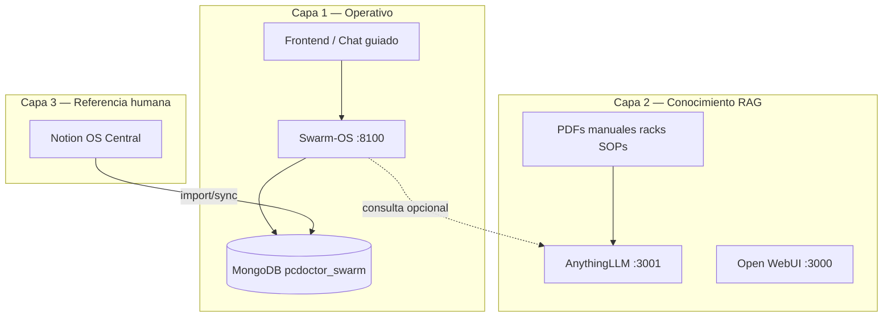

# Frontend, importación Notion y ecosistema IA (192.168.1.4)

**Servidor:** `ralphi-ia-ver-10` / `192.168.1.4`  
**Desde Windows:** siempre `http://192.168.1.4:PUERTO`

---

## 1. Qué tienes hoy en el servidor

| Servicio | Puerto | Rol |
|----------|--------|-----|
| **Swarm-OS API** | 8100 | Cerebro operativo: clientes, visitas, cotizaciones, gates |
| **MongoDB** | 27017 | Verdad operativa DBxx |
| **Open WebUI** | 3000 | Chat con Ollama (tipo ChatGPT local) |
| **AnythingLLM** | 3001 | RAG: documentos, manuales, racks (conocimiento) |
| **Ollama** | 11434 | Modelos locales |
| **Whisper** | 9001 | Voz → texto |
| **n8n** | 5678 | Automatizaciones, webhooks |
| **Qdrant** | 6333 | Vectores (Ralphi / inneros) |

---

## 2. Tres capas — no mezclar



| Capa | Pregunta que responde | Tecnología |
|------|----------------------|------------|
| **Operativo** | ¿Cuánto cuesta? ¿Qué cliente? ¿Qué cotización PCD-COT-26-001? | MongoDB + API 8100 |
| **Conocimiento** | ¿Cómo se instala este rack? ¿Qué dice el manual? | AnythingLLM / Qdrant |
| **Referencia** | Reglas humanas, vistas, historial | Notion (importar a Mongo) |

**AnythingLLM NO reemplaza MongoDB.** Es para preguntar sobre documentos.  
**MongoDB NO busca semánticamente en PDFs de 200 páginas.** Para eso está AnythingLLM.

---

## 3. Frontend — opciones (de rápida a completa)

### Opción A — Chat guiado sobre Swarm-OS (recomendada Fase B)

Similar a Google AI Studio pero **conectado a MongoDB real**:

- Pantalla única: micrófono + texto
- El backend mantiene **estado de conversación** (máquina de estados):

```
Usuario: "Hazme una cotización"
  → Sistema: "¿Para qué cliente? Dime RUC, nombre o cédula"
Usuario: "0991386866001"
  → Gate anti-duplicado → si existe: usar; si no: crear DB04 + Hub
  → Sistema: "Cliente ASOPAR. ¿Qué servicio o productos?"
Usuario: "2 cámaras IP y mano de obra"
  → Buscar DB26/DB13 → si no existe: ofrecer crear
  → Armar DB38 líneas → mostrar precios → confirmar
  → Generar PCD-COT-26-XXXX + PDF
```

**Stack sugerido:**
- UI simple: HTML/React en `frontend/` o extender Open WebUI con **funciones/tools** que llamen `:8100`
- Voz: botón → grabar → `POST /inspection/{id}/upload-audio` (Whisper ya funciona)

### Opción B — Open WebUI (:3000) como chat general

Ya instalado. Puede usar Ollama pero **no conoce tu MongoDB** sin configurar tools/plugins.

Uso: preguntas generales.  
Limitación: no ejecuta flujo cotización con gates DB38 solo.

### Opción C — Panel administrativo (Fase C)

Tipo mini-ERP local:

- Lista clientes, inventario, cotizaciones
- Formularios por DB (cliente, línea, producto)
- Para Rafael en oficina; el técnico usa chat/voz en campo

### Opción D — Cursor + API (hoy)

Tú hablas con el agente en Cursor; él llama la API. Funciona para desarrollo, no para técnicos en urbanización.

---

## 4. Flujo cotización en UI (lo que pediste)

| Paso | Lógica | DB / API |
|------|--------|----------|
| 1 | Detectar intención "cotizar" | agente director |
| 2 | Pedir cliente | `POST /gates/client/duplicate-check` + `create_client` |
| 3 | Hub si falta | `ensure_client_hub` |
| 4 | Pedir alcance / voz / fotos | `POST /inspection/quick` + upload-audio |
| 5 | Buscar productos | `inventory_search` → DB26 / DB13 |
| 6 | Si no existe producto | formulario o "crear ítem" → `inventory_items` |
| 7 | Definir servicio | `catalog_products` |
| 8 | Calcular precios | DB38 + DB28 historial precios |
| 9 | Revisar margen | gates DB41 + SOP margen |
| 10 | Exportar | PDF-first → `documents` |

Esto es un **asistente con formulario implícito** (preguntas), no pantallas fijas como AI Studio — pero se puede hacer igual de visual con tarjetas por paso.

---

## 5. Importar Notion → MongoDB

Tienes datos llenos en Notion. Tres caminos:

### Camino 1 — CSV export (rápido, recomendado primero)

Ya tienes exports en el servidor:

```
/home/rlopez/backups/.../notion_data/.../DB26 — Inventario Hardware....csv
```

Script `scripts/import_notion_csv.py` (por crear) lee CSV → `inventory_items`, `catalog_products`, `clients`, etc.

**Ventajas:** simple, sin API, una vez o periódico.  
**Desventajas:** relaciones Notion (URLs) hay que remapear a `client_id`, `supplier_id`.

### Camino 2 — Notion API (sync vivo)

- Crear integración en notion.so → Internal Integration Token
- Guardar en `.env`: `NOTION_TOKEN=`
- Script consulta cada database_id DB04, DB26, DB13…
- Upsert en Mongo por `notion_page_id` (campo de trazabilidad)

**Ventajas:** sync bidireccional posible, datos frescos.  
**Desventajas:** más código; rate limits; mapear propiedades Notion → Mongo.

### Camino 3 — n8n (ya usaste para export)

Flujo n8n: Notion trigger → transform → HTTP POST a API Swarm-OS o directo Mongo.

**Ventajas:** visual, sin código pesado.  
**Desventajas:** mantener workflows.

### Orden recomendado

1. **DB26 inventario** + **DB13 catálogo** + **DB25 proveedores** (para cotizar con precios reales)
2. DB04 clientes + DB05 contactos
3. Resto según necesidad

---

## 6. RAG (Retrieval Augmented Generation) — aclaración

**RAG** no es un producto: es una **técnica**.

1. Subes muchos documentos (bucket de PDFs, SOPs, manuales)
2. Se vectorizan (embeddings)
3. Al preguntar, se recuperan trozos relevantes y el LLM responde con ese contexto

**AnythingLLM** es una aplicación que **implementa RAG** con interfaz web (:3001).

| Sistema en tu servidor | ¿Es RAG? | Uso |
|------------------------|----------|-----|
| AnythingLLM :3001 | Sí | Chat sobre documentos subidos |
| Qdrant :6333 | Motor vectores | Backend RAG (inneros/Ralphi) |
| MongoDB | **No** | Datos operativos: precios, clientes, cotizaciones |
| Swarm-OS API | **No** | Lógica de negocio y gates |

Los agentes Swarm-OS **pueden consultar** RAG como herramienta; los precios **siempre** salen de MongoDB.

---

## 7. AnythingLLM — qué es y por qué se quedó "subiendo"

**Sí está instalado:** `http://192.168.1.4:3001`  
Contenedor: `anythingllm`, volumen `/home/rlopez/anythingllm_storage`

### Rol en tu arquitectura

| Pregunta | Usar |
|----------|------|
| "¿Precio de la cámara X?" | **MongoDB** DB26 |
| "¿Cómo cablear este rack APC?" | **AnythingLLM** (manual PDF) |
| "Cotización para ASOPAR" | **Swarm-OS API** |

Conexión futura: agente Cotizador tiene **tool** `search_knowledge_base(query)` → AnythingLLM API interna.

### Por qué el upload se queda colgado (causas típicas)

1. **Modelo de embeddings** en Ollama lento o no configurado (nomic-embed-text, etc.)
2. **Archivo grande** (PDF rack 50MB) sin timeout suficiente
3. **Worker de embedding** bloqueado — reiniciar contenedor
4. Logs muestran `No direct uploads path found` — problema de ruta `/collector/hotdir` vs UI upload

**Prueba rápida:**
```bash
docker restart anythingllm
# Subir PDF pequeño (<5MB) primero
# En AnythingLLM: Settings → Embedding → Ollama → nomic-embed-text
```

AnythingLLM y Swarm-OS **no compiten**: uno es biblioteca técnica, otro es ERP operativo.

---

## 7. Arquitectura objetivo (resumen)

```
Técnico en campo (móvil/Windows)
    ↓ voz/texto
Frontend chat guiado (nuevo o Open WebUI+tools)
    ↓
Swarm-OS API :8100
    ├→ MongoDB (clientes, cotizaciones, precios) ← import Notion CSV/API
    ├→ Whisper (transcripción)
    ├→ Ollama (razonamiento agentes)
    └→ AnythingLLM (opcional: manuales racks)
    ↓
PDF / WhatsApp / correo (n8n)
```

---

## 8. Próximos pasos concretos

| Prioridad | Tarea |
|-----------|-------|
| 1 | Import CSV DB26+DB13+DB25 desde backup Notion |
| 2 | Frontend mínimo: página chat + voz → API 8100 |
| 3 | Máquina de estados "crear cotización" en API |
| 4 | Arreglar AnythingLLM embeddings (upload racks) |
| 5 | Tool RAG opcional en agentes |
