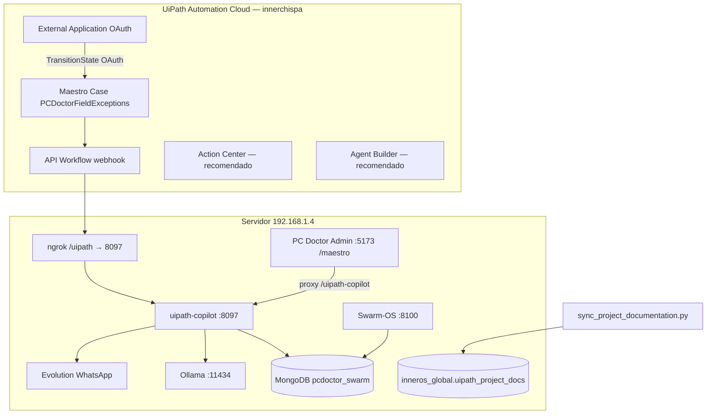

# Proyecto Maestro Completo — uipath-copilot (documento maestro)

**Última actualización:** 2026-06-27  
**Proyecto:** UiPath AgentHack 2026 — Track 1 Maestro Case  
**Empresa:** InnerChispa / PC Doctor S.A.  
**Servidor:** `192.168.1.4` · puerto aislado **8097**

> Este archivo es la **fuente de verdad** del estado del proyecto. Se sincroniza a MongoDB con `scripts/sync_project_documentation.py` (colección `inneros_global.uipath_project_docs`).

---

## 1. Qué es y qué NO es

| Sí es | No es (obsoleto / otro hackathon) |
|-------|-----------------------------------|
| Orquestador **UiPath Maestro Case** en cloud | `hackathon_band/` (Band of Agents) |
| Backend FastAPI **8097** con MongoDB real | Blueprint Gemini con **PostgreSQL** |
| Excepciones operativas PC Doctor (duplicados, gates, HITL) | SRE puro de infra PostgreSQL |
| Ollama local + Evolution WhatsApp | Featherless/AIML como motor principal |

---

## 2. Arquitectura actual



---

## 3. Lo implementado (servidor)

### Backend `uipath_copilot/`

| Módulo | Función |
|--------|---------|
| `app.py` | FastAPI, CORS, `/status` |
| `routes.py` | Webhook, casos, demo, **project-docs** |
| `processor.py` | Gates PC Doctor + Ollama + transición Maestro |
| `case_store.py` | Colección `uipath_maestro_cases` |
| `maestro_client.py` | OAuth client_credentials + TransitionState |
| `project_docs_store.py` | Docs en `inneros_global.uipath_project_docs` |

### Endpoints (:8097)

| Método | Ruta | Uso |
|--------|------|-----|
| GET | `/status` | Salud Mongo/Ollama/WhatsApp/UiPath |
| POST | `/api/v1/uipath-webhook` | Entrada desde Maestro API Workflow |
| GET | `/api/v1/cases` | Casos auditados (frontend :5173) |
| GET | `/api/v1/demo/trigger-sample` | Demo jurado con cliente MongoDB real |
| GET | `/api/v1/project-docs` | Índice documentación sincronizada |
| GET | `/api/v1/project-docs/{id}` | Documento completo |

### Infra y scripts

| Script | Qué hace |
|--------|----------|
| `run_uipath_copilot.sh` | Arranca API |
| `setup_hackathon.sh` | Bootstrap docs + stack |
| `scripts/install_uipath_cli.sh` | Node 20 + `uip` CLI |
| `scripts/build_maestro_case_cli.sh` | Genera `maestro/pcdoctor_field_exceptions.json` |
| `scripts/uipath_discover_org.py` | OAuth + lista **Org Unit ID** |
| `scripts/sync_project_documentation.py` | Markdown → MongoDB |
| `scripts/push_github.sh` | Repo público (sin `.env`) |

### ngrok público

Ver `data/uipath_public_url.txt`:

```
https://sworn-profusely-alongside.ngrok-free.dev/uipath/api/v1/uipath-webhook
```

### Frontend conectado

- Admin **:5173** → menú **Maestro Case** (`/maestro`)
- Proxy Vite: `/uipath-copilot/*` → `:8097`
- **No** se duplicó el router de Gemini: ya existía `GET /api/v1/cases`

---

## 4. Configuración `.env` (solo local, NUNCA git)

Archivo: `/home/rlopez/projects/uipath-copilot/.env` (en `.gitignore`).

| Variable | Descripción |
|----------|-------------|
| `UIPATH_BASE_URL` | `https://cloud.uipath.com/innerchispa/DefaultTenant` |
| `UIPATH_CLIENT_ID` | App ID External Application (Admin) |
| `UIPATH_CLIENT_SECRET` | App Secret entre comillas si contiene `#` |
| `UIPATH_ORG_UNIT_ID` | `7983347` — parámetro `fid=` en URL Orchestrator |
| `UIPATH_OPERATOR_WHATSAPP` | WhatsApp HITL |
| `UIPATH_COPILOT_PUBLIC_URL` | Base ngrok `/uipath` |

**Seguridad:** si pegaste secretos en chat, regenera App Secret en Admin → External Applications.

**App Secret con `#` en el valor:** en `.env` usa comillas dobles (`UIPATH_CLIENT_SECRET="..."`) o el token se trunca.

---

## 5. Dónde encontrar cosas en UiPath Cloud

| Qué buscas | Dónde en el panel |
|------------|-------------------|
| **Client ID / Secret** | Admin → **External Applications** |
| **URL tenant** | Barra del navegador: `cloud.uipath.com/innerchispa/{tenant}/...` |
| **Org Unit ID** | Orchestrator → **Folders** → abrir carpeta → copiar **Id** (GUID) |
| **Licencias Community** | Admin → **Licenses** |
| **Case Maestro** | **Maestro** → Processes (publicar `PCDoctorFieldExceptions`) |
| **Action Center (HITL)** | Action Center → tareas humanas |

Comando automático Org Unit:

```bash
cd /home/rlopez/projects/uipath-copilot
source venv/bin/activate 2>/dev/null || true
python3 scripts/uipath_discover_org.py
```

Pega el `UIPATH_ORG_UNIT_ID` que imprima en `.env` y reinicia `:8097`.

---

## 6. Case Maestro local

Archivo: `maestro/pcdoctor_field_exceptions.json`  
Nombre: **PCDoctorFieldExceptions**  
Stages: Intake → Investigation → Remediation → Approval  

Generado con CLI; falta **publicar en cloud** y añadir **API Workflow** con webhook ngrok en stage Intake.

---

## 7. Agentes y documentación automática

| Agente | Rol |
|--------|-----|
| **AG-21** `hackathon_docs_harvester` | Scrape Devpost/docs → `docs/hackathon_resources/` |
| **AG-12** `project_provisioner` | Provisiona puerto + bootstrap |
| Pool PC Doctor | AG-14 cliente, AG-16 cotizador, AG-10 revisor en `inneros_core/agents_pool/` |

**Documentación viva en MongoDB:**

```bash
python3 scripts/sync_project_documentation.py
curl http://127.0.0.1:8097/api/v1/project-docs
curl http://127.0.0.1:8097/api/v1/project-docs/proyecto-maestro-completo
```

Ejecutar sync tras cada cambio importante en docs (o en cron).

---

## 8. Licencia Community — qué usar para ganar (fácil primero)

Ver detalle: [`COMMUNITY_LICENSE_ROADMAP.md`](COMMUNITY_LICENSE_ROADMAP.md)

| Prioridad | Producto | Esfuerzo | Impacto jurado |
|-----------|----------|----------|----------------|
| 1 | **Maestro Case** + API Workflow | Medio | Obligatorio Track 1 |
| 2 | **Action Center** | Bajo | HITL visible en cloud |
| 3 | **Agent Builder** | Medio | Agente UiPath nativo |
| 4 | **Apps** (Case App) | Medio | UI aprobación Rafael |
| 5 | **Test Manager** | Bajo | 1 test del flujo |
| 6 | Document Understanding | Medio | PDF inspección 2 págs |
| 7 | Data Fabric | Alto | Solo si hay tiempo |

**No priorizar ahora:** Process Mining, IXP, Computer Vision masivo (límites Community).

---

## 9. Pendiente (checklist corto)

- [ ] Confirmar `UIPATH_BASE_URL` + `UIPATH_ORG_UNIT_ID` (script discover)
- [ ] Publicar case en Maestro cloud + webhook ngrok
- [ ] Probar `curl :8097/status` → `uipath_maestro.reachable: true`
- [ ] Demo video: Maestro + :5173/maestro + WhatsApp
- [ ] `bash scripts/push_github.sh` (repo sin secretos)
- [ ] Devpost + deck

---

## 9b. Arranque automático y git (192.168.1.4)

**Ruta proyecto:** `/home/rlopez/projects/uipath-copilot`

| Qué | Comando (una vez) |
|-----|-------------------|
| Cron @reboot + cada 5 min | `bash scripts/install_uipath_autostart.sh` |
| Systemd (mejor, requiere sudo) | `sudo cp scripts/swarm-uipath-copilot.service /etc/systemd/system/ && sudo systemctl daemon-reload && sudo systemctl enable --now swarm-uipath-copilot` |
| Git push seguro cada 6 h | incluido en cron (`git_sync_uipath_copilot.sh` — **nunca** sube `.env` ni `.uipath_secret`) |
| Docs → MongoDB | `python3 scripts/sync_project_documentation.py` |

Verificar:

```bash
curl http://192.168.1.4:8097/status
curl http://127.0.0.1:8097/api/v1/project-docs
crontab -l | grep uipath-copilot
```

**Importante:** el servicio systemd anterior corría como `root` — corregir con el unit de `scripts/swarm-uipath-copilot.service` (usuario `rlopez`).

---

## 10. Mapa de otros documentos

| Archivo | Cuándo leerlo |
|---------|---------------|
| `README.md` | Arranque rápido |
| `AGENTS.md` | Reglas Cursor |
| `docs/TU_CHECKLIST_3_CLICKS.md` | Solo acciones manuales en UiPath |
| `docs/SUBMISION_JURADO.md` | Video Devpost |
| `docs/HACKATHON_REQUIREMENTS.md` | Checklist jurado |
| `docs/UIPATH_MAESTRO_BLUEPRINT.md` | ⚠️ Histórico Gemini/SRE — no spec actual |
| `docs/DONDE_ESTA_TODO.md` | Ecosistema :8100/:5173 completo |

---

## 11. Verificación rápida

```bash
curl http://192.168.1.4:8097/status
curl http://192.168.1.4:8097/api/v1/demo/trigger-sample
curl http://192.168.1.4:8097/api/v1/project-docs
# Admin: http://192.168.1.4:5173/maestro
```
