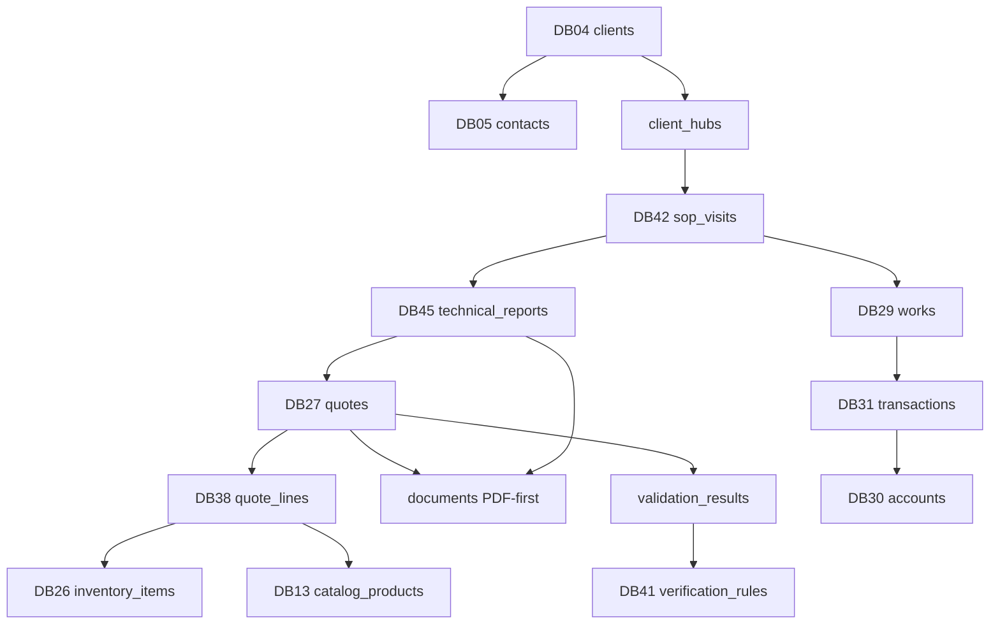

# Relaciones y flujos — OS Central → MongoDB

**Servidor:** `192.168.1.4` — base `pcdoctor_swarm`  
**Implementación gates:** `tools/gates.py`  
**Registro vivo en Mongo:** colección `_schema_registry` + `_flow_registry`

---

## 1. Flujo principal PC Doctor (campo)



---

## 2. Relaciones por objeto (IDs en Mongo)

### Cliente (onboarding)

| Desde | Campo | Hacia | Cardinalidad |
|-------|-------|-------|--------------|
| `clients` | `client_id` | `client_hubs.client_id` | 1:1 |
| `clients` | `primary_contact_id` | `contacts.contact_id` | N:1 |
| `contacts` | `client_id` | `clients.client_id` | N:1 |

**Gate:** `hub_ready=true` antes de crear cotización/reporte/PDF.

### Ejecución campo

| Desde | Campo | Hacia | Notas |
|-------|-------|-------|-------|
| `sop_visits` | `client_id` | `clients` | obligatorio |
| `sop_visits` | `visit_id` | `technical_reports.visit_id` | 1:N |
| `sop_visits` | `visit_id` | `works.visit_id` | 0:1 |
| `sop_visits` | `visit_id` | `media_assets.visit_id` | 1:N |
| `technical_reports` | `report_id` | `quotes.report_id` | 0:1 |
| `works` | `quote_id` | `quotes` | 0:1 |

### Cotización (matemática sagrada)

| Desde | Campo | Hacia | Regla |
|-------|-------|-------|-------|
| `quotes` | `quote_id` | `quote_lines.quote_id` | 1:N, ≥1 línea |
| `quote_lines` | `inventory_item_id` | `inventory_items` | si tipo Hardware |
| `quote_lines` | `catalog_product_id` | `catalog_products` | si tipo Servicio |
| `quote_lines` | `supplier_id` | `suppliers` | opcional |
| `quotes` | `code` | `serials` DB40 | PCD-COT-26-XXXX |

**Gate:** `quotes.total` = Σ `quote_lines.subtotal_linea` + IVA. Cabecera no edita totales a mano.

### PDF-first

| Desde | Campo | Hacia |
|-------|-------|-------|
| `documents` | `target_type`+`target_id` | quote / technical_report / sop_visit |
| `documents` | `client_id` | `clients` |
| `documents` | `hub_id` | `client_hubs` |

**Gate listo para enviar:** existe `documents` con `formato=pdf` o `md` aprobado, sin placeholders.

### Finanzas (dinero real)

| Desde | Campo | Hacia | Regla |
|-------|-------|-------|-------|
| `works` | `work_id` | `transactions` vía `work_id` | si hubo cobro |
| `invoices` | `invoice_id` | `transactions.invoice_id` | |
| `transactions` | `account_id` | `accounts` | DB31 = verdad |

**Gate:** si `works.precio_cobrado > 0` → debe existir transacción DB31.

### Editorial (no desde cotización)

| Paso | Colección |
|------|-----------|
| 1 | `works` o `technical_reports` |
| 2 | `field_captures` DB47 |
| 3 | `editorial_pipeline` DB48 |
| 4 | `editorial_campaigns` DB49 |

---

## 3. Anti-duplicación (antes de crear)

| Colección | Match por |
|-----------|-----------|
| `clients` | `ruc`, `name`, `phone`, `email` |
| `contacts` | `client_id` + `email` o `phone` |
| `suppliers` | `ruc` o `nombre` |
| `inventory_items` | `sku`, `item_code` |
| `catalog_products` | `code` |
| `projects` | `code`, `client_id`+`name` |
| `quotes` | `client_id`+`fecha`+`total` (heurística) |

Función: `gates.check_duplicate()`

---

## 4. Secuencia operativa (API / agentes)

```
1. lookup_ruc → create_client (DB04) + ensure_hub
2. create_contact (DB05) si aplica
3. create_sop_visit (DB42) + next_serial SOP
4. append media_assets, findings
5. create_technical_report (DB45) + next_serial RPT
6. create_quote (DB27) + quote_lines (DB38) + next_serial COT
7. run_gates_ready_to_send(quote_id)
8. export document → documents
9. optional: create_work (DB29) + transaction (DB31) al cobrar
10. log ai_provenance (DB52) cada paso
```

---

## 5. Hub — subpáginas lógicas (Mongo)

En Notion son páginas. En Mongo el hub agrupa referencias:

```json
{
  "hub_id": "hub_xxx",
  "client_id": "cli_xxx",
  "sections": {
    "cotizaciones": ["qot_abc"],
    "trabajos": ["wrk_abc"],
    "reportes": ["rpt_abc"],
    "pdfs_exportables": ["doc_abc"],
    "infraestructura": [],
    "notas_internas": []
  }
}
```

---

## 6. Separación anti-caos (routing)

| Si el input es… | Colección destino | NO guardar en… |
|-----------------|-------------------|----------------|
| Idea suelta | `ideas` DB11 | DB45, DB27 |
| KPI / ahorro tiempo | `productivity_metrics` DB37 | DB11 |
| Reporte técnico campo | `technical_reports` DB45 | `ideas` |
| Producto vendible | `catalog_products` DB13 | DB26 stock |
| Oferta comercial | `offers` DB06 | DB27 |
| Proyecto real | `projects` DB08 | DB11 |
| Automatización | `automations` DB14 | cualquier otra |

---

## 7. Endpoints sugeridos (fase siguiente)

| Endpoint | Flujo |
|----------|-------|
| `POST /client/onboard` | DB04+DB05+Hub |
| `POST /visit/start` | DB42 |
| `POST /report/create` | DB45 |
| `POST /quote/create` | DB27+DB38 |
| `POST /quote/{id}/validate` | gates DB41 |
| `POST /quote/{id}/ready-to-send` | gate final |
